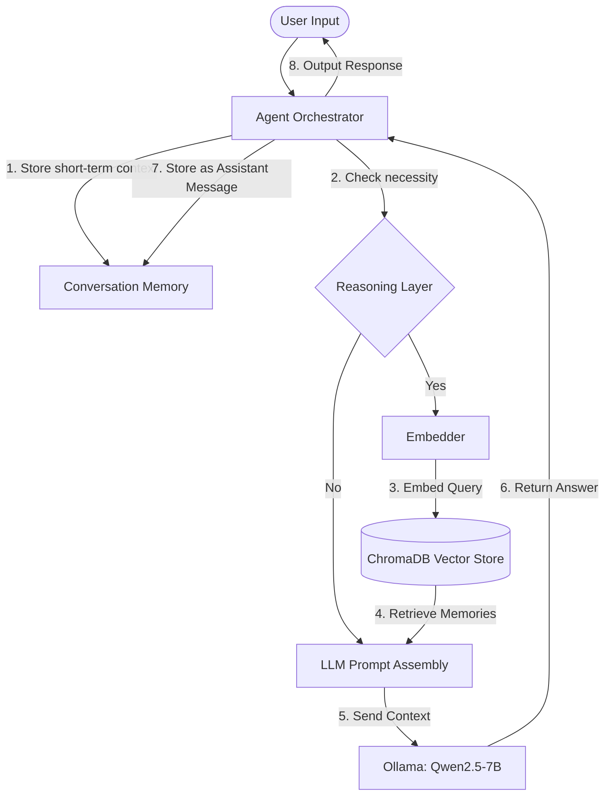

# 🛡️ DigiFortress

An advanced, secure LLM agent architecture featuring **semantic memory persistence**, active **context reasoning**, and real-time **memory classification**. 

DigiFortress dynamically decides when to query its vector memory store, categorizes incoming memories, maintains conversation context, and reasons through user queries prior to synthesis via a local large language model.

---

## 🏗️ Core Architecture & Flow



---

## ✨ Features

- 🧠 **Persistent Semantic Memory**: Integrates ChromaDB and HuggingFace's `sentence-transformers` (`all-MiniLM-L6-v2`) to embed and recall user data persistently.
- 🚦 **Intelligent Reasoning Layer**: Dynamically intercepts incoming user queries to evaluate whether semantic context retrieval is required or if it can be answered using direct short-term context.
- 🏷️ **Smart Memory Classification**: Automatically classifies new facts, preferences, tasks, and instructions to tag metadatas cleanly.
- 💬 **Conversation Buffer**: Keeps sliding window context limits (configurable, default `20` messages) to ensure high-fidelity local LLM prompting.
- 💻 **Interactive Shell Interface**: Simple CLI interface for registering memories, testing model intelligence, viewing database contents, and exiting safely.

---

## 📁 Repository Structure

```
DigiFortress/
├── src/
│   ├── agent/
│   │   ├── agent.py            # Main Agent orchestrating memory, LLM, and reasoning
│   │   ├── conversation.py     # Conversation history buffer & flow manager
│   │   └── reasoning.py        # Intercepts queries to check if memory is required
│   │
│   ├── memory/
│   │   ├── memory_manager.py   # Persistent ChromaDB client integration
│   │   ├── memory_classifier.py# Classifies memories into preferences, tasks, facts, etc.
│   │   └── memory_viewer.py    # Formatted printer for stored collection memories
│   │
│   ├── embeddings/
│   │   └── embedder.py         # Local Sentence Transformers vectorizer wrapper
│   │
│   ├── llm/
│   │   └── llm_handler.py      # Ollama connector client for local model generation
│   │
│   ├── utils/
│   │   └── helpers.py          # General-purpose utility helpers
│   │
│   └── logs/
│       └── reasoning.log       # Log traces for query routing & decision logs
│
├── data/
│   └── chroma_db/              # Persistent SQLite database store
│
├── tests/
│   └── test_memory.py          # Pytest unit testing suite
│
├── docs/
│   ├── project_charter.md      # Strategic outline & phase deliverables
│   └── phase1_design.md        # Technical details and engineering design
│
├── requirements.txt            # System dependencies
├── README.md                   # Project documentation
├── .gitignore                  # Git tracking exclusions
└── main.py                     # Entry interactive command CLI
```

---

## 🚀 Setup & Installation

### 1. Prerequisites
Ensure you have **Python 3.10+** and [Ollama](https://ollama.com/) installed on your machine.

### 2. Clone the Repository
```bash
git clone https://github.com/VedzKun/DigiFortress.git
cd DigiFortress
```

### 3. Set Up Virtual Environment
Create and activate your local Python virtual environment:
```powershell
# On Windows
python -m venv digifortress_env
.\digifortress_env\Scripts\activate
```

### 4. Install Dependencies
```bash
pip install -r requirements.txt
```

### 5. Download Local LLM
Ensure Ollama is running in your taskbar, then pull the required **Qwen2.5** model:
```bash
ollama pull qwen2.5:7b
```

---

## 🎮 How to Run

Launch the interactive console shell using:

```bash
python main.py
```

### Options inside the Shell:
- **`1` (Remember)**: Inputs a new fact or preference to be classified and permanently stored in your SQLite-backed Chroma database.
- **`2` (Ask)**: Evaluates your question through the **Reasoning Layer**, pulls semantic history if required, and retrieves an LLM synthesis.
- **`3` (View Memory)**: Displays all stored long-term memories with their tags, sources, and timestamps.
- **`4` (Exit)**: Exits the shell safely.
