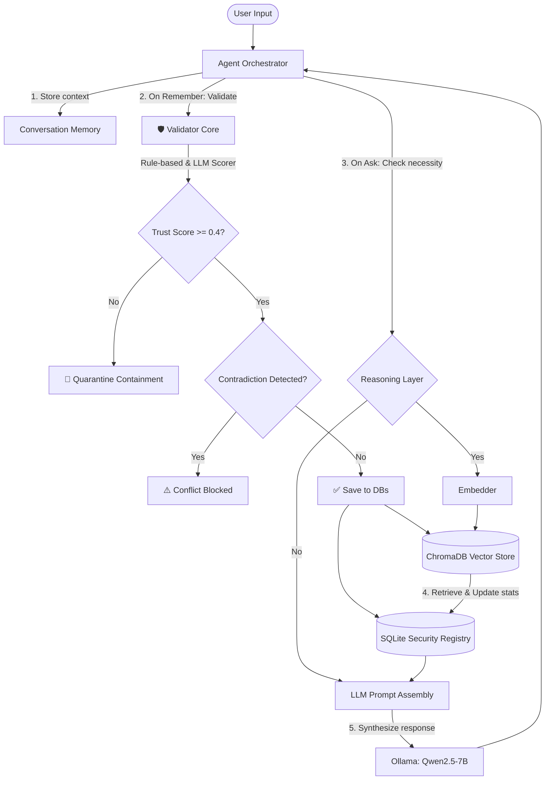

# 🛡️ DigiFortress

An advanced, secure LLM agent architecture featuring **semantic memory persistence**, active **context reasoning**, and real-time **security defense validation**. 

DigiFortress dynamically decides when to query its vector memory store, categorizes incoming memories, screens memories against prompt injections and logical contradictions, and synthesizes answers using a local LLM.

---

## 🏗️ Core Architecture & Flow



---

## ✨ Features

* 🧠 **Persistent Semantic Memory**: Integrates ChromaDB and HuggingFace's `sentence-transformers` (`all-MiniLM-L6-v2`) to embed and recall user data persistently.
* 🚦 **Intelligent Reasoning Layer**: Dynamically intercepts queries to evaluate whether semantic context retrieval is required or if it can be answered using direct short-term context.
* 🛡️ **Active Memory Validation Core**:
  * **Rule-based, LLM & Source Reputation Trust Scorer**: Filters incoming payloads through trust scores (calculating weights of 30% rule-based, 50% LLM-based, and 20% source reputation scoring). Low-trust submissions are automatically quarantined (threshold < 0.4).
  * **LLM Conflict Detector**: Evaluates new memories against similar, overlapping historical beliefs to detect and block logical contradictions in real-time.
  * **Decay & Reputation Analytics**: Automatically calculates a memory's decay score over time and computes active reputation scores based on access counts and trust weightings.
  * **Security Event Log & Risk Auditing**: Evaluates real-time risk scores (0 to 100) and risk levels (Low, Moderate, High, Critical) using a dynamic risk engine, and logs all memory validation audits persistently to the SQLite registry.
* ⚔️ **Adversarial Attack Simulator**: Launches prompt injection attacks (e.g. system overrides, exfiltrations) to test the security boundaries of validation layers.
* 🖥️ **Interactive Shell & Dashboard**: A standard console terminal menu, accompanied by a premium **Streamlit Web UI** visualising metrics and pipeline updates dynamically.

---

## 📁 Repository Structure

```
DigiFortress/
├── src/
│   ├── agent/
│   │   ├── agent.py            # Main Agent orchestrating memory, LLM, and reasoning
│   │   ├── conversation.py     # Conversation history buffer & flow manager
│   │   └── reasoning.py        # Intercepts queries to check if memory is required
│   │
│   ├── memory/
│   │   ├── memory_manager.py   # Persistent ChromaDB client integration
│   │   └── memory_classifier.py# Classifies memories into preferences, tasks, facts, etc.
│   │
│   ├── defenses/
│   │   ├── validator.py        # Evaluates trust and coordinates conflicts/decisions
│   │   ├── trust_scorer.py     # Rule-based static check evaluating trust weights
│   │   ├── llm_trust_scorer.py # Dynamic trust checks utilizing HuggingFace models
│   │   ├── llm_conflict_detector.py # Contradiction detector running on local Qwen LLM
│   │   └── quarantine.py       # Temporary containment for quarantined memories
│   │
│   ├── database/
│   │   └── security_db.py      # SQLite analytics db tracking access, metrics & reputations
│   │
│   ├── security/
│   │   └── risk_engine.py      # Risk assessment engine calculating risk scores and levels
│   │
│   ├── embeddings/
│   │   └── embedder.py         # Local Sentence Transformers vectorizer wrapper
│   │
│   ├── attacks/
│   │   └── poisoning_simulator.py # Injector simulator launching adversarial payloads
│   │
│   └── llm/
│       └── llm_handler.py      # Ollama connector client for local model generation
│
├── data/
│   ├── security.db             # SQLite database storing analytics records
│   └── chroma_db/              # Persistent Vector database
│
├── requirements.txt            # System dependencies
├── README.md                   # Project documentation
├── main.py                     # Entry interactive CLI shell
└── app.py                      # Premium Streamlit Web Application
```

---

## 🚀 Setup & Installation

### 1. Prerequisites
Ensure you have **Python 3.10+** and [Ollama](https://ollama.com/) installed on your machine.

### 2. Clone the Repository
```bash
git clone https://github.com/VedzKun/DigiFortress.git
cd DigiFortress
```

### 3. Set Up Virtual Environment
Create and activate your local Python virtual environment:
```powershell
# On Windows
python -m venv digifortress_env
.\digifortress_env\Scripts\activate
```

### 4. Install Dependencies
```bash
pip install -r requirements.txt
```

### 5. Download Local LLM
Ensure Ollama is running in your taskbar, then pull the required **Qwen2.5** model:
```bash
ollama pull qwen2.5:7b
```

---

## 🎮 How to Run

### Option A: Streamlit Web UI (Recommended) 🛡️
Launch the premium web console featuring interactive pages, step-by-step pipeline animations, and real-time simulator charts:

```bash
python -m streamlit run app.py
```
This will open your default browser to `http://localhost:8501`.
* **🔒 Security Dashboard**: Real-time KPI metrics, active threat assessment levels, and dynamic Plotly bars.
* **🧠 Core Memory Manager**: Interactive search panel to view access logs, reputations, or purge memories.
* **✍️ Remember (New Memory)**: Visualize the embedding generation, context overlapping, trust scoring, and final integration decision.
* **💬 Ask Agent (Chat)**: Sandbox to chat with the agent and view exact episocic context retrievals.
* **⚔️ Attack Simulator**: Launch adversarial waves, watching verification logs, blockages, and metrics updates in real-time.

### Option B: Interactive CLI Shell 💻
Launch the standard shell interface inside the terminal:

```bash
python main.py
```
* **`1` (Remember)**: Inputs a new belief, running validation defenses and storing accepted values.
* **`2` (Ask)**: Synthesizes responses based on active context.
* **`3` (View Memory)**: Formatted listing of saved memories.
* **`4` (Analytics)**: Print detailed reputation, access counts, and decay scores from SQLite.
* **`5` (Security Dashboard)**: Display defense success rates and blocked counts.
* **`6` (Run Attack Simulation)**: Inject test payloads and report status.
* **`7` (Exit)**: Safely closes connections and exits.
* **`8` (Source Reputations)**: Display active reputation scores and metrics (accepted, conflict, quarantined counts) for each belief source.
* **`9` (Security Events)**: View detailed, reverse-chronological logs of all security evaluation events (payload, source, status, risk score, risk level, and timestamp).
