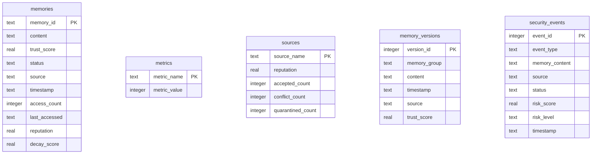

# DigiFortress System Architecture Design

This document details the software architecture, core math formulas, and database schema for DigiFortress.

---

## 🏗️ Technical Stack & Frameworks

- **Vector Memory DB**: [ChromaDB](https://www.trychroma.com/) (Persistent Local Client)
- **Embedding Vectorizer**: [HuggingFace Sentence Transformers](https://huggingface.co/sentence-transformers) (`all-MiniLM-L6-v2`, 384-dimensional dense vectors)
- **Orchestration LLM**: Local [Ollama](https://ollama.com/) Client (running `qwen2.5:7b`)
- **Web UI & Visualization**: Streamlit, Plotly, Pandas
- **Relational Auditing DB**: SQLite3

---

## 🧮 Core Algorithms & Mathematical Formulas

### 1. Active Trust Score
When a new memory is proposed, it is evaluated by the [Validator](file:///c:/Users/HP/DigiFortress/src/defenses/validator.py) using a combination of static rules, LLM analysis, and historical source reputation:

$$\text{Trust Score} = (S_{\text{rule}} \times 0.3) + (S_{\text{llm}} \times 0.5) + (R_{\text{source}} \times 0.2)$$

Where:
- $S_{\text{rule}}$: Rule-based static check score (0.0 to 1.0)
- $S_{\text{llm}}$: LLM-based prompt/trust evaluation score (0.0 to 1.0)
- $R_{\text{source}}$: Source reputation from the SQLite tracking database (0.0 to 1.0)

**Threshold Rule**: If $\text{Trust Score} < 0.4$, the memory is automatically classified as `quarantined` and blocked from active storage.

---

### 2. Risk Assessment Engine
The [RiskEngine](file:///c:/Users/HP/DigiFortress/src/security/risk_engine.py) calculates the dynamic risk score of every memory submission event:

$$\text{Risk Score} = \max\left(0, \min\left(100, 100 - (T \times 50) - (R_{\text{source}} \times 30) + \Delta_{\text{status}}\right)\right)$$

Where:
- $T$: Computed Trust Score (0.0 to 1.0)
- $R_{\text{source}}$: Source Reputation (0.0 to 1.0)
- $\Delta_{\text{status}}$: Status penalty offset:
  - $+15$ if status is `conflict` (logical contradiction detected)
  - $+25$ if status is `quarantined` (low trust score)
  - $0$ otherwise

#### Risk Levels
- **CRITICAL**: $\text{Risk Score} \ge 75$
- **HIGH**: $75 > \text{Risk Score} \ge 50$
- **MODERATE**: $50 > \text{Risk Score} \ge 25$
- **LOW**: $\text{Risk Score} < 25$

---

### 3. Source Reputation Updates
Source reputation is dynamically adjusted with every submission:
- **Accepted Memory**: Reputation increases by $+0.05$ (max $1.0$)
- **Conflict Memory**: Reputation decreases by $-0.03$ (min $0.0$)
- **Quarantined Memory**: Reputation decreases by $-0.10$ (min $0.0$)

---

### 4. Memory Decay & Reputation
Memories in long-term storage decay over time, but build reputation based on access frequency:

$$\text{Decay Score} = \max\left(0.3, 1 - (\text{Age in Days} \times 0.01)\right)$$

$$\text{Memory Reputation} = \min\left(1.0, (T \times 0.5) + (\text{Decay Score} \times 0.3) + \min(\text{Accesses} \times 0.01, 0.2)\right)$$

---

## 🗄️ SQLite Database Schema (`security.db`)

All metadata, source reputations, and security audit logs are managed inside `data/security.db`.

### Table Definitions

#### 1. `memories`
Stores the active metadata and access counters for memories stored in ChromaDB.
- `memory_id` (TEXT, Primary Key): Unique ChromaDB reference UUID.
- `content` (TEXT): The actual memory belief string.
- `trust_score` (REAL): Evaluated trust level.
- `status` (TEXT): Current state (e.g. `'accepted'`, `'conflict'`).
- `source` (TEXT): The source identifier.
- `timestamp` (TEXT): ISO format creation timestamp.
- `access_count` (INTEGER): Number of times retrieved.
- `last_accessed` (TEXT): ISO format of last access.
- `reputation` (REAL): Computed query-time reputation score.
- `decay_score` (REAL): Time-decay multiplier.

#### 2. `security_events`
The secure audit trail logs all evaluations performed by the validator.
- `event_id` (INTEGER, Primary Key AUTOINCREMENT): Auto-incremented event sequence.
- `event_type` (TEXT): Category of event (e.g., `'MEMORY_EVALUATION'`).
- `memory_content` (TEXT): Evaluated input text.
- `source` (TEXT): Creator/submitter of memory.
- `status` (TEXT): Outcome status (`'accepted'`, `'conflict'`, `'quarantined'`).
- `risk_score` (REAL): Computed risk score from `RiskEngine`.
- `risk_level` (TEXT): Qualitative risk assessment (`'LOW'`, `'MODERATE'`, `'HIGH'`, `'CRITICAL'`).
- `timestamp` (TEXT): ISO format timestamp when validation occurred.

#### 3. `sources`
Tracks reputation scores and aggregate metrics for belief sources.
- `source_name` (TEXT, Primary Key)
- `reputation` (REAL): Dynamic weight (starts at `0.5`, bounds `[0.0, 1.0]`)
- `accepted_count` (INTEGER)
- `conflict_count` (INTEGER)
- `quarantined_count` (INTEGER)

#### 4. `memory_versions`
Tracks versions of updated/replaced memory groupings.
- `version_id` (INTEGER, Primary Key AUTOINCREMENT)
- `memory_group` (TEXT)
- `content` (TEXT)
- `timestamp` (TEXT)
- `source` (TEXT)
- `trust_score` (REAL)

#### 5. `metrics`
System-wide counters (e.g., total accepted, total conflicts, total quarantined, attack attempts).
- `metric_name` (TEXT, Primary Key)
- `metric_value` (INTEGER)

